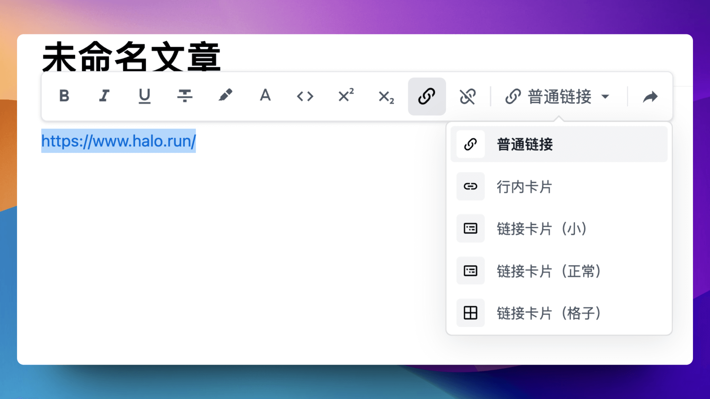

# Halo 编辑器超链接卡片插件

Halo 的编辑器插件，能够在编辑器中将普通的超链接转为卡片形式，可以用于丰富网站的内容展示。

## 特性

- 与默认编辑器深度集成，开箱即用。
- 支持行内和块级链接卡片，其中块级卡片支持三种风格。
- 支持为链接的网站设置代理。
- 支持缓存链接信息的请求结果。
- 支持 Dark Mode。

## 安装与使用

1. 在[应用市场](https://www.halo.run/store/apps/app-UpUJA)中安装并启用此插件。
2. 在编辑器中选中一个超链接，如图选择所需链接类型即可。

    

## 预览


## 作为标签使用

如果你使用默认编辑器，那么参考上面的[安装与使用](#安装与使用)即可在文章中插入链接卡片。此外，因为此插件的 UI 部分最终会编译为 [Web Component](https://developer.mozilla.org/en-US/docs/Web/API/Web_components)，所以你可以将其当做一个常规的 HTML 标签插入到网站的任意位置。

### hyperlink-card

块级链接卡片，使用方式：

```html
<hyperlink-card href="https://www.halo.run" target="_blank" theme="regular"></hyperlink-card>
```

参数：

- `href`：链接地址。
- `target`：链接打开方式，可选值为 `_blank`、`_self`，默认为 `_self`。
- `theme`：卡片风格，可选值为 `regular`、`small`、`grid`，默认为 `regular`。

### hyperlink-inline-card

行内链接卡片，使用方式：

```html
<hyperlink-inline-card href="https://www.halo.run" target="_blank"></hyperlink-inline-card>
```

参数：

- `href`：链接地址。
- `target`：链接打开方式，可选值为 `_blank`、`_self`，默认为 `_self`。

## 主题适配

### 自定义样式

此插件通常无需主题主动适配，可以开箱即用，但也暴露出了部分 CSS 变量。

目前已提供的 CSS 变量：

| 变量名                                        | 描述                 |
|-----------------------------------------------|--------------------|
| `--halo-hyperlink-card-bg-color`              | 卡片背景颜色         |
| `--halo-hyperlink-card-inline-bg-color`       | 行内卡片背景颜色     |
| `--halo-hyperlink-card-inline-hover-bg-color` | 行内卡片悬停背景颜色 |
| `--halo-hyperlink-card-title-color`           | 标题颜色             |
| `--halo-hyperlink-card-inline-title-color`    | 行内标题颜色         |
| `--halo-hyperlink-card-description-color`     | 描述文字颜色         |
| `--halo-hyperlink-card-link-color`            | 链接颜色             |
| `--halo-hyperlink-card-bg-gradient`           | 背景渐变             |
| `--halo-hyperlink-card-border-color`          | 边框颜色             |
| `--halo-hyperlink-card-border-hover-color`    | 边框悬停颜色         |

<details>
<summary>点击查看 CSS 代码模板</summary>

```css
:root {
  --halo-hyperlink-card-bg-color: ;
  --halo-hyperlink-card-inline-bg-color: ;
  --halo-hyperlink-card-inline-hover-bg-color: ;

  --halo-hyperlink-card-title-color: ;
  --halo-hyperlink-card-inline-title-color: ;

  --halo-hyperlink-card-description-color: ;
  --halo-hyperlink-card-link-color: ;
  --halo-hyperlink-card-bg-gradient: ;
  --halo-hyperlink-card-border-color: ;
  --halo-hyperlink-card-border-hover-color: ;
}
```

</details>

### 配色切换方案

根据上面提供的 CSS 变量，也可以通过定义 CSS 变量的方式为链接卡片提供动态切换配色的功能。

以下是实现示例，你可以根据需求自行修改选择器或者媒体查询。

<details>
<summary>点击查看示例</summary>

```css
@media (prefers-color-scheme: dark) {
  .color-scheme-auto,
  [data-color-scheme='auto'] hyperlink-card {
    color-scheme: dark;
    --halo-hyperlink-card-bg-color: #18181b;
    --halo-hyperlink-card-inline-bg-color: #3f3f46;
    --halo-hyperlink-card-inline-hover-bg-color: #52525b;

    --halo-hyperlink-card-title-color: #f4f4f5;
    --halo-hyperlink-card-inline-title-color: #f4f4f5;

    --halo-hyperlink-card-description-color: #a1a1aa;
    --halo-hyperlink-card-link-color: #e4e4e7;
    --halo-hyperlink-card-bg-gradient: linear-gradient(#454545, #454545),
      linear-gradient(transparent, transparent);
    --halo-hyperlink-card-border-color: #52525b;
    --halo-hyperlink-card-border-hover-color: #e4e4e7;
  }
}

.color-scheme-dark,
.dark,
[data-color-scheme='dark'] hyperlink-card {
    color-scheme: dark;
    --halo-hyperlink-card-bg-color: #18181b;
    --halo-hyperlink-card-inline-bg-color: #3f3f46;
    --halo-hyperlink-card-inline-hover-bg-color: #52525b;

    --halo-hyperlink-card-title-color: #f4f4f5;
    --halo-hyperlink-card-inline-title-color: #f4f4f5;

    --halo-hyperlink-card-description-color: #a1a1aa;
    --halo-hyperlink-card-link-color: #e4e4e7;
    --halo-hyperlink-card-bg-gradient: linear-gradient(#454545, #454545),
      linear-gradient(transparent, transparent);
    --halo-hyperlink-card-border-color: #52525b;
    --halo-hyperlink-card-border-hover-color: #e4e4e7;
}
```

</details>

此外，为了让主题可以更加方便的适配暗黑模式，此插件也提供了一套暗黑模式的配色方案，主题可以直接使用此方案，而不需要自己去适配暗黑模式，适配方式如下：

1. 在 html 或者 body 标签添加 class：
   1. `color-scheme-auto`：自动模式，根据系统的暗黑模式自动切换。
   2. `color-scheme-dark` / `dark`：强制暗黑模式。
   3. `color-scheme-light` / `light`：强制明亮模式。
2. 在 html 或者 body 标签添加 `data-color-scheme` 属性：
   1. `auto`：自动模式，根据系统的暗黑模式自动切换。
   2. `dark`：强制暗黑模式。
   3. `light`：强制明亮模式。
